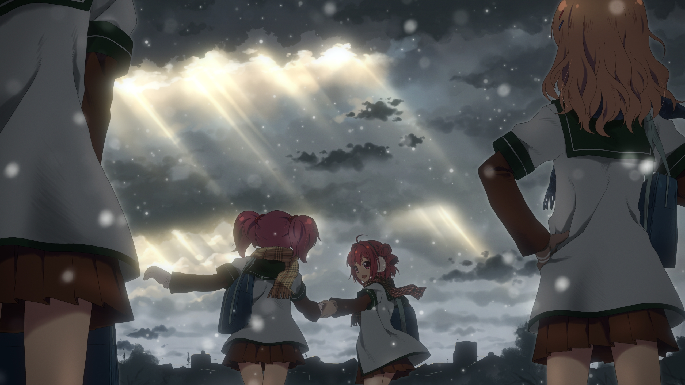

<p align="center">
  <a href="https://mundoyuri.com/">
    
  </a>
</p>

<p align="center">
  <strong>Más historias GL. Más visibles. Más fáciles de encontrar. Siempre gratis.</strong>
</p>

<p align="center">
  <a href="https://mundoyuri.com/">Visitar Mundo Yuri</a>
  ·
  <a href="#cómo-aportar">Aportar al proyecto</a>
  ·
  <a href="#desarrollo-local">Ejecutar localmente</a>
</p>


## ¿Qué es Mundo Yuri?

**Mundo Yuri** es un proyecto comunitario creado para descubrir, organizar y compartir más historias **Girls' Love (GL)**: anime, series, películas, doramas y nuevos episodios.

El objetivo principal es sencillo: **que exista más GL, que tenga más visibilidad y que más personas puedan encontrarlo**.

Este proyecto no nació para vender acceso. Nació para reunir a una comunidad alrededor de las historias que nos gustan.

## Nuestro compromiso

> **Mundo Yuri será siempre gratuito.**

- **0 donativos.** No solicitamos dinero para mantener el proyecto o el servidor.
- **0 membresías.** No existen cuentas premium ni beneficios reservados para quien pague.
- **0 pagos.** Nadie tiene que pagar para acceder al sitio o participar en la comunidad.
- **0 muros de pago.** El contenido y las funciones no se bloquean detrás de una suscripción.
- **100 % comunidad.** El proyecto crece gracias al tiempo, conocimiento, creatividad y cariño de quienes aportan.

El servidor no se sostiene cobrando a los usuarios, solicitando donaciones ni vendiendo membresías. La prioridad no es monetizar: **la prioridad es que haya más GL disponible, organizado y visible para todas las personas**.

## Gracias a la comunidad

Gracias a cada persona que aporta algo, sin importar su tamaño.

Gracias por compartir una serie, reportar un enlace, corregir un dato, probar una función, traducir un texto, proponer una idea, escribir código, diseñar una imagen o simplemente recomendar Mundo Yuri a alguien más.

Cada aporte ayuda. **Este proyecto también es tuyo.**

## El sitio

Mundo Yuri incluye:

- Catálogo de anime, series GL, películas y doramas.
- Páginas de series, temporadas y episodios.
- Reproductores con diferentes fuentes de video.
- Búsqueda, géneros y secciones personalizadas.
- Perfiles, favoritos, seguidores y comentarios.
- Mensajes privados y notificaciones dentro del sitio.
- Avisos por correo para nuevos episodios, controlados por cada usuario.
- Envío comunitario de nuevas series y episodios.
- Panel de administración, moderación, roles y permisos.
- Asistente de la comunidad Miyu.

### Una parte de nuestra identidad visual



## Cómo aportar

No necesitas donar dinero ni comprar una membresía. Puedes ayudar de muchas formas:

- Proponer o registrar una nueva serie GL.
- Compartir información o fuentes de episodios.
- Corregir títulos, fechas, descripciones o imágenes.
- Reportar errores y enlaces que ya no funcionan.
- Probar cambios y explicar qué podría mejorar.
- Ayudar con diseño, accesibilidad o experiencia de usuario.
- Traducir o mejorar textos.
- Programar nuevas funciones o corregir errores.
- Documentar procesos para que otras personas puedan colaborar.

Para aportar código:

1. Crea un fork del repositorio.
2. Abre una rama descriptiva para tu cambio.
3. Implementa y prueba tu aporte.
4. Envía un pull request explicando qué mejora y cómo se verificó.

También puedes abrir un issue con una idea o un problema reproducible. No publiques contraseñas, llaves, tokens ni información privada en los issues.

## Tecnología

- PHP 8.3 o superior.
- Laravel 13.
- MySQL en producción; SQLite también es compatible para desarrollo y pruebas.
- Blade, JavaScript y CSS.
- Bootstrap y Metronic para el panel administrativo.
- Vite y PostCSS para recursos del frontend.
- PHPUnit para pruebas automatizadas.

## Desarrollo local

### Requisitos

- PHP 8.3+
- Composer
- Node.js y npm
- MySQL o SQLite

### Instalación rápida

```bash
git clone https://github.com/sts19813/mundoyuri.git
cd mundoyuri
composer run setup
```

Revisa el archivo `.env`, configura la conexión a la base de datos y, si vas a utilizar funciones externas, agrega solamente las credenciales necesarias en tu entorno local.

Para iniciar el entorno de desarrollo:

```bash
composer run dev
```

### Instalación manual

```bash
composer install
cp .env.example .env
php artisan key:generate
php artisan migrate
npm install
npm run build
php artisan serve
```

Si utilizas almacenamiento local para imágenes, crea también el enlace público:

```bash
php artisan storage:link
```

## Pruebas

Ejecuta la suite con:

```bash
php artisan test
```

Para aplicar el formato del proyecto:

```bash
vendor/bin/pint
```

## Configuración importante

Las variables sensibles pertenecen únicamente al archivo `.env`. Nunca deben subirse al repositorio.

Algunas integraciones disponibles son:

- Envío de correo para bienvenida y nuevos episodios.
- Inicio de sesión con Google.
- Almacenamiento y reproducción mediante Backblaze B2.
- Proveedores externos de video configurables desde el panel.

Consulta `.env.example` para conocer las variables soportadas.

## Filosofía del proyecto

Mundo Yuri no mide el valor de una persona por cuánto dinero aporta. Lo importante es construir un espacio útil, respetuoso y sostenible mediante colaboración.

**Si aportaste cualquier cosa, gracias.**<br>
**Si ayudaste a que alguien encontrara una nueva historia GL, el proyecto ya cumplió una parte de su objetivo.**

<p align="center">
  <strong>0 donativos · 0 membresías · 0 muros de pago · Más GL para todas las personas</strong>
</p>
